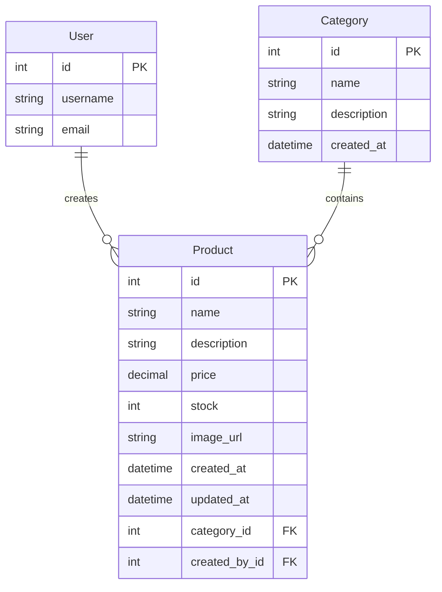

# API Database Design

**Submission:** [Insert Google Doc Link Here]

## Entity Relationship Diagram (ERD)

Below is the text representation of the database schema for the E-commerce API.

### Entities

1.  **User** (Django Built-in)
    - `id` (PK)
    - `username`
    - `email`
    - `password`
    - ... (other standard Django User fields)

2.  **Category**
    - `id` (PK)
    - `name` (String): Name of the category.
    - `description` (Text): Optional description.
    - `created_at` (DateTime): Timestamp of creation.

3.  **Product**
    - `id` (PK)
    - `name` (String): Name of the product.
    - `description` (Text): Detailed description.
    - `price` (Decimal): Price of the product.
    - `stock` (Integer): Available quantity.
    - `image_url` (URL): Optional link to product image.
    - `created_at` (DateTime): Timestamp of creation.
    - `updated_at` (DateTime): Timestamp of last update.
    - `category_id` (FK): Foreign Key linking to **Category**.
    - `created_by_id` (FK): Foreign Key linking to **User**.

### Relationships

- **Category** to **Product**: One-to-Many
  - One Category can have multiple Products.
  - Each Product belongs to one Category.
  - `on_delete=CASCADE`: If a Category is deleted, its Products are also deleted.

- **User** to **Product**: One-to-Many
  - One User (Admin/Staff) can create multiple Products.
  - Each Product is created by one User.
  - `on_delete=SET_NULL`: If the User is deleted, the Product remains but `created_by` becomes NULL.

### Mermaid Diagram

